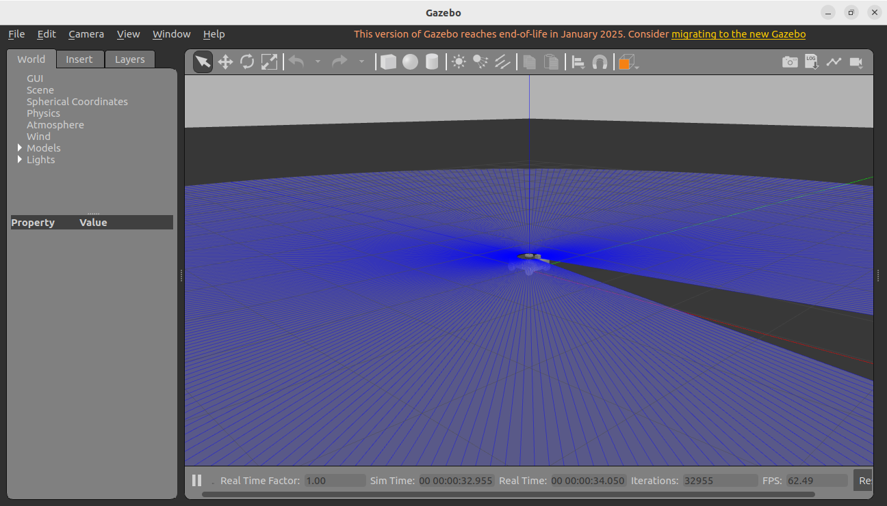
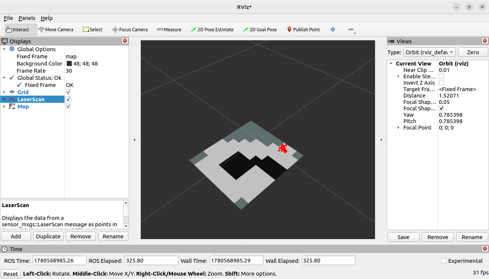
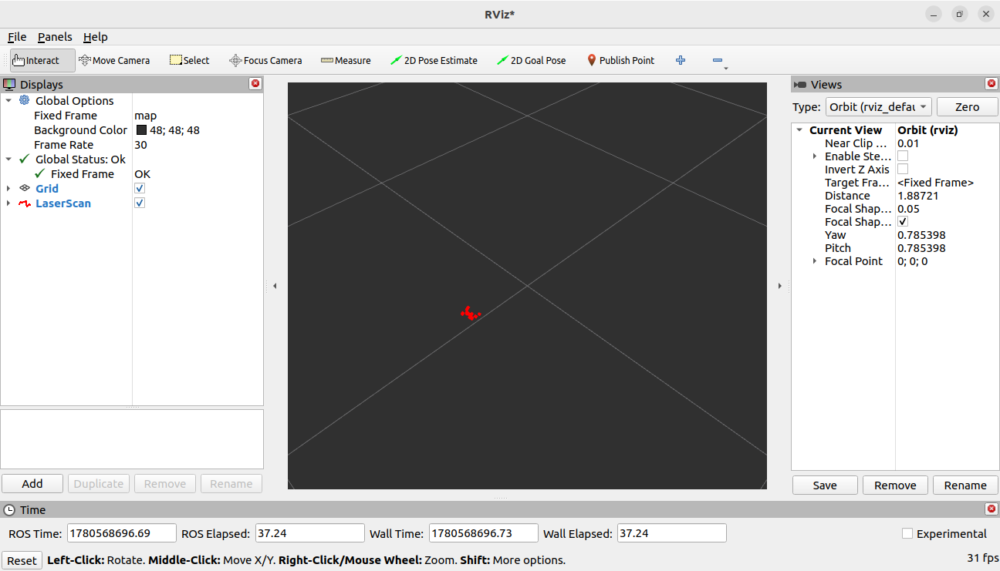

# Autonomous Warehouse Robot using ROS 2 Humble

## Project Overview

This project implements an Autonomous Warehouse Robot simulation using ROS 2 Humble, Gazebo Classic, RViz2, and SLAM Toolbox.

The robot can navigate inside a simulated warehouse environment while generating a real-time occupancy grid map using SLAM. The system is designed to demonstrate robot modeling, simulation, mapping, and visualization in a ROS 2 ecosystem.

---

## Features

- Four-wheel mobile robot
- URDF-based robot modeling
- Gazebo Classic simulation
- LiDAR sensor integration
- Real-time SLAM mapping
- RViz2 visualization
- Keyboard teleoperation
- TF tree integration
- Occupancy grid map generation

---

## Software Used

| Software | Version |
|-----------|-----------|
| ROS 2 | Humble Hawksbill |
| Gazebo | Classic 11.10.2 |
| RViz2 | Humble |
| SLAM Toolbox | ROS 2 Humble |
| TF2 | ROS 2 Humble |
| URDF | Robot Modeling |

---

## Project Structure

```text
warehouse_ws/
└── src/
    └── warehouse_robot_description/
        ├── launch/
        │   ├── robot.launch.py
        │   └── slam.launch.py
        ├── urdf/
        │   └── robot.urdf
        ├── package.xml
        └── CMakeLists.txt
```

---

## System Architecture

```text
Gazebo Simulation
        │
        ▼
 Robot Model (URDF)
        │
        ▼
    LiDAR Sensor
        │
        ▼
   /scan Topic
        │
        ▼
   SLAM Toolbox
        │
        ▼
 Map Generation
        │
        ▼
 RViz Visualization
```

---

## Build Instructions

```bash
cd ~/warehouse_ws
colcon build --symlink-install
source install/setup.bash
```

---

## Launch Simulation

```bash
ros2 launch warehouse_robot_description robot.launch.py
```

---

## Launch SLAM

```bash
ros2 launch warehouse_robot_description slam.launch.py
```

---

## Teleoperate Robot

```bash
ros2 run teleop_twist_keyboard teleop_twist_keyboard
```

---

## Results

The robot successfully:

- Navigates inside the Gazebo environment
- Receives real-time LiDAR scan data
- Generates a 2D occupancy grid map
- Visualizes mapping results in RViz2
- Maintains TF transforms between map, odom, and base_link
- Demonstrates real-time SLAM using SLAM Toolbox

---

## Screenshots

### Gazebo Simulation



### RViz Mapping



### Laser Scan



---

## Future Improvements

- Autonomous Navigation using Nav2
- Obstacle Avoidance
- Dynamic Path Planning
- Multi-Robot Warehouse System
- Object Detection and Tracking
- Pick-and-Place Operations

---

## Author

**Madhumathi Peddireddy**

GitHub:
https://github.com/peddireddymadhumathi2005-sketch

---

## License

This project is licensed under the MIT License.
